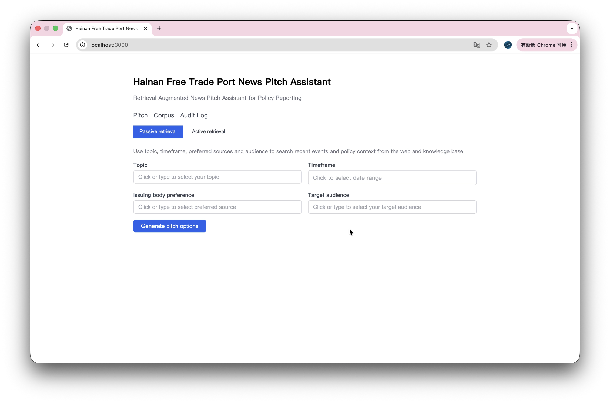
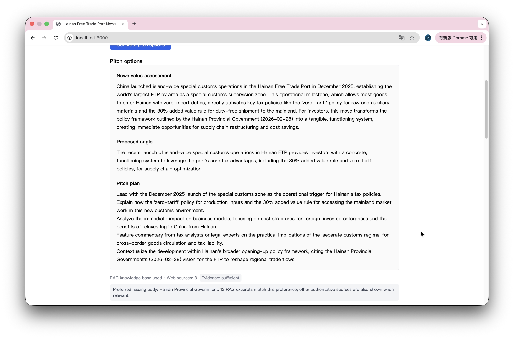

# Retrieval Augmented News Pitch Assistant for Hainan Free Trade Port Policy Reporting

## Overview

This project implements a domain-scoped retrieval-augmented news pitch assistant for Hainan Free Trade Port policy reporting.  
It is designed for early-stage policy-news ideation and pre-pitch research.  
The system prioritises traceability via hybrid retrieval, reranking, structured generation, evidence binding, downgrade handling, and audit logging.

Key contributions:
- Domain-scoped bilingual policy corpus for Hainan FTP reporting
- Evidence-grounded pitch generation rather than generic policy QA
- Enforceable claim-evidence binding at span level
- Conservative downgrade behaviour when evidence is insufficient
- Reproducible evaluation with Gold Task Set, dev tuning, and no-retrieval baseline

## Key Features

- Hybrid retrieval over a curated Hainan FTP policy corpus
- Cross-encoder reranking for evidence prioritisation
- Structured pitch output with span-level citations
- Downgrade handling when evidence is weak or non-authoritative
- Audit logging for retrieval, latency, and failure analysis
- Evaluation package with Gold Task Set, dev tuning, and baseline comparison

## Demo




## Architecture

- **Frontend**: Next.js + React + TypeScript
- **Backend**: FastAPI
- **Knowledge Base**: Hainan Free Trade Port official policies, laws, and authoritative interpretations
- **Evaluation Package**: Gold task set, baselines, threshold tuning, and reproducible metrics

## Core Logic

### Evidence Binding
- Each claim-bearing field must link to at least one evidence span from the indexed corpus
- Evidence displays: issuing body, publication date, document type, stable source ID
- One-click navigation from claim to evidence

### Downgrade Handling
- **Evidence insufficient**: after hybrid retrieval + reranking (`TOP_K=12`), no allowlisted authoritative issuer achieves reranker score >= `0.45`
- **Behaviour**: rewrite affected fields in non-assertive form and label the reason (low relevance / no authoritative source found / missing provenance metadata)

## Example Workflow

1. Enter a policy-reporting topic or beat.
2. The backend retrieves candidate evidence spans from the indexed corpus.
3. A reranker selects the most relevant and authoritative evidence.
4. The system generates structured pitch options with citations.
5. If evidence is insufficient, output fields are downgraded and labelled explicitly.

### Example Input

Beat: Hainan Free Trade Port cross-border data policy

### Example Output

- Proposed angle
- News value assessment
- Pitch plan
- Evidence spans with issuing body and publication date
- Downgrade label if evidence is insufficient

## Main Results

On the 50-task Gold Task Set:

- Citation Support Rate: **1.0000** with retrieval vs **0.0000** without retrieval
- Mean angle overlap: **0.4488** with retrieval vs **0.1045** without retrieval
- Mean latency: **22.9s** with retrieval vs **10.4s** without retrieval

Additional findings:
- Multilingual retrieval configuration improved downstream framing alignment in embedding A/B runs
- Study 0 supported the rationale for a Hainan-scoped assistant


## Reproducibility

To reproduce the main dissertation outputs:

1. Build or load the indexed corpus.
2. Run Gold Task Set evaluation.
3. Run the no-retrieval baseline.
4. Run threshold tuning on the dev set.
5. Run embedding comparison.
6. Run Study 0 scripts and plotting scripts.

Key files:
- `evaluation/gold_tasks/tasks.json`
- `evaluation/gold_tasks/dev_tasks.json`
- `evaluation/harness/`
- `evaluation_results.json`
- `evaluation/threshold_tuning_results.json`
- `evaluation/figures/`

Typical commands:

```bash
make install
make corpus
make eval
python evaluation/harness/run.py --both
python evaluation/harness/tune_thresholds.py
python evaluation/harness/compare_embedding_runs.py evaluation_results_baseline.json evaluation_results_multilingual.json
```

## Key Entry Points

- `backend/app/main.py` - FastAPI application entry point
- `backend/app/services/reactive_pitch.py` - main reactive orchestration workflow
- `backend/app/services/retrieval/retrieval.py` - hybrid retrieval logic
- `backend/app/services/audit.py` - audit logging
- `scripts/corpus_manager.py` - corpus management
- `evaluation/harness/` - evaluation scripts
- `evaluation/gold_tasks/tasks.json` - Gold Task Set
- `data/metadata.json` - corpus metadata
- `data/chunks/chunks_index.json` - indexed span records

## Directory Structure

```text
hnftp_news/
├── frontend/          # Next.js frontend
├── backend/           # FastAPI backend
├── scripts/           # Corpus manager (fetch, extract)
├── knowledge_base/    # Chunk/build index scripts
├── evaluation/        # Gold tasks, study assets, harness
├── data/              # metadata, chunks, audit logs
└── shared/            # Shared types and config
```

## Requirements

- Python 3.10+
- Node.js 18+
- npm 9+
- Optional OpenAI-compatible API for proactive pitch generation

## Start The System (Run Backend And Frontend Together)

**Step 1: Start backend (terminal 1)**

```bash
cd backend
pip install -r requirements.txt
# If you hit an ascii codec error, add PYTHONUTF8=1:
PYTHONUTF8=1 uvicorn app.main:app --reload --host 0.0.0.0 --port 8000
# Or:
uvicorn app.main:app --reload --host 0.0.0.0 --port 8000
```

After startup, open [http://localhost:8000/docs](http://localhost:8000/docs) to verify API availability.

**Step 2: Start frontend (terminal 2)**

```bash
cd frontend
npm install
npm run dev
```

Then open [http://localhost:3000](http://localhost:3000).

If no pitch cards appear, confirm backend health: [http://localhost:8000/health](http://localhost:8000/health) should return `{"status":"healthy"}`.

## Connect LLM (Proactive Pitch Generation)

Proactive mode supports OpenAI or compatible APIs for richer pitch copy generation; if not configured, it falls back to the built-in deterministic generator.

1. Configure API key (choose one):
   - Create `.env` in project root (you can copy `.env.example`)
   - Or export `LLM_API_KEY` / `OPENAI_API_KEY`
2. Optional variables:
   - `LLM_BASE_URL` or `OPENAI_BASE_URL`
   - `LLM_MODEL` (default `gpt-4o-mini`)
   - `LLM_TIMEOUT_SEC` (default `45`)
3. Restart backend and test Proactive mode

## Environment Example

Example `.env` keys:

```bash
LLM_API_KEY=sk-your-key
OPENAI_API_KEY=sk-your-key
LLM_BASE_URL=
OPENAI_BASE_URL=
LLM_MODEL=gpt-4o-mini
LLM_TIMEOUT_SEC=45
SERPER_API_KEY=your-serper-key
```

## Evaluation

```bash
make eval
# or:
python evaluation/harness/run.py
python evaluation/harness/run.py --both
```

## API Endpoints

- `POST /api/retrieval` - retrieve evidence spans
- `POST /api/generation` - generate pitch draft
- `POST /api/validate` - validate draft (reactive mode)
- `GET /api/corpus` - corpus overview
- `GET /api/audit` - audit log
- `GET /api/evaluation/run` - run evaluation

## Limitations

- This is a research prototype rather than a newsroom deployment system
- Corpus coverage depends on the curated Hainan FTP policy knowledge base
- Some results may vary if external APIs or source pages change
- Authority is treated as a provenance heuristic, not a guarantee of truth

## Citation

If you reference this project, please cite:

Pengwei Fu. *Retrieval Augmented News Pitch Assistant for Hainan Free Trade Port Policy Reporting*. CUH603CMD Graduation Project, Communication University of China / Coventry University, 2025/26.

## Acceptance Criteria Summary

1. Evidence binding: each claim field links to evidence with visible metadata
2. Downgrade: explicit failure handling and labelling when evidence is insufficient
3. Audit log: retrieval IDs, filters, model version, latency, downgrade labels
4. Response time: typical 15s, hard timeout 60s (configured in `backend/app/core/config.py`)
